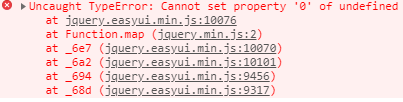

# EasyUI:Cannot read property 'width' of null

最近在使用EasyUI DataGrid来做前端的报表开发，遇到了这个报错：

`Uncaught TypeError: Cannot read property 'width' of null`。在网上查找解决方案，基本上都告诉你检查各种属性名是否有拼写的错误，一般都是这个原因导致的。我自己也做了检查，并没有发现什么问题，以下是我的代码：

```text
columns: [
                    [
                        { align: 'center', colspan: "4", title: "支付宝" },
                        { align: 'center', colspan: "4", title: "微信-APP" },
                        { align: 'center', colspan: "4", title: "微信-公众号" },
                        { align: 'center', colspan: "4", title: "建行" },
                        { align: 'center', colspan: "4", title: "银联" },
                        { field: 'incomeCount_total', align: 'center', rowspan: 2, title: "合计收入笔数" },
                        { field: 'income_total', align: 'center', rowspan: 2, title: "合计收入金额" },
                        { field: 'payCount_total', align: 'center', rowspan: 2, title: "合计支出笔数" },
                        { field: 'pay_total', align: 'center', rowspan: 2, title: "合计支出金额" }
                    ]
]
```

查找了很多的解决办法，依然没找出问题所在，后面自己想着有没有可能是colspan的值不应该是字符串类型，因为想到报的是`width`的问题，然后自己就尝试将`"4"`修改为`4`，果然没报错了。这真的很让人无语，因为自己用过的table插件里面，LayUI以及JqGrid等，都没有强制要求这些方面，同时这个报错并未指向具体的原因，所以会让很多人摸不着头脑，我自己也是比较幸运，才能找到问题的所在。

  
不过，这还没完，因为我有冻结列，所以要添加冻结列的配置，然后我有复杂表头，因此有rowspan，以下是一个局部的配置代码:

```text
frozenColumns: [[
    { field: 'reason', align: 'center', "rowspan": 2, title: "业务类型" }
]],
columns: [
    [
        { align: 'center', colspan: 4, title: "支付宝" },
        { align: 'center', colspan: 4, title: "微信-APP" },
        { align: 'center', colspan: 4, title: "微信-公众号" },
        { align: 'center', colspan: 4, title: "建行" },
        { align: 'center', colspan: 4, title: "银联" },
        { field: 'incomeCount_total', align: 'center', rowspan: 2, title: "合计收入笔数" },
        { field: 'income_total', align: 'center', rowspan: 2, title: "合计收入金额" },
        { field: 'payCount_total', align: 'center', rowspan: 2, title: "合计支出笔数" },
        { field: 'pay_total', align: 'center', rowspan: 2, title: "合计支出金额" }
    ]
]
```

我吸取教训，冻结列的rowspan给到了整数类型，但是依然还是报了错误：



`Uncaught TypeError: Cannot set property '0' of undefined`。这个真让我觉得奇怪了，另外一个错误，然后还没能在网上找到解决办法。但是心想肯定还是rowspan那个地方有问题，就慢慢的尝试修改它的值类型，都无果，后面索性干掉rowspan算了，因为反正也解决不了，然后复杂表头那个地方就将就着吧，谁能想到，去掉rowspan后，没报错，然后也正常的合并了2格，这是真的神奇：


由此可见，EasyUI的冻结列不需要配置合并单元格的情况，框架自己会处理。同时不仅要吐槽一下这个插件，界面不仅古老，插件的错误处理也很不科学。

